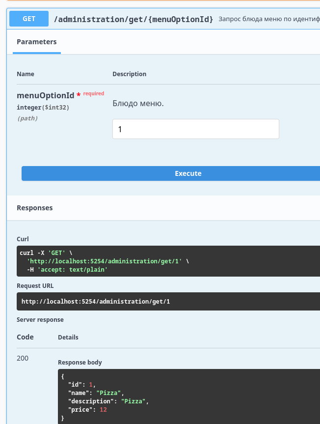

## **Сервис управления службой доставки еды.**

**TODO:** _microservice UserGateway пользовательский шлюз и microservice ClientsGateway клиентский шлюз._

Реализация хранлища InMemory
```
private readonly List<MenuOptionEntity> _menuOption = new();
```
```
private readonly List<OrderEventBase> _events = new();
```


Интерфейсы связаны с реализациями посредством DI.
```
services.AddScoped<IAdministrationCommandHandler, AdministrationCommandHandler>();
services.AddScoped<IAdministrationCommandRepository, AdministrationCommandRepository>();
services.AddScoped<IAdministrationQueryRepository, AdministrationQueryRepository>();
services.AddScoped<IAdministrationQueryHandler, AdministrationQueryHandler>();
services.AddSingleton<IAdministrationMapper<MenuOptionDto, MenuOptionEntity>, AdministrationCommandMapper>();
services.AddScoped<IOrderCommandHandler, OrderCommandHandler>();
services.AddSingleton<IEventStore, InMemoryEventStore>();
services.AddSingleton<IAdministrationStore, InMemoryMenuOptionStore>();
```

**1. Контроллер Administration**
Реализует функционал администрирования какрты блюд (паттерн CQRS). Хэндлеры и репозитории разделены на синхронно
обрабатывающиекоманды на создани, рдактирование, удаление записи и прключание статуса записи и на асинхронные запросы на
получение записи по идентифкатору и получение отфильтрованного списка блюд из меню.
 

**2. Контроллер OrdersController**
Реализует синхронный функционал управления заказами (паттерн EventsSourcing+CQRS). При создании заказа ему назначается
идентификатор, который в дальнейшем испрользуется для привязки входящих событий к заказу. Минимальная реализация --
создаем заказ, добавлям в него блюда, при необходимости закрываем заказ как доставленный.

**3. Контроллер OrderReportController**
Реализует функционал асинхронных запросов информации о событиях составляющих заказ и "вычисление" текущего статуса
заказа (паттерн EventsSourcing+CQRS)
